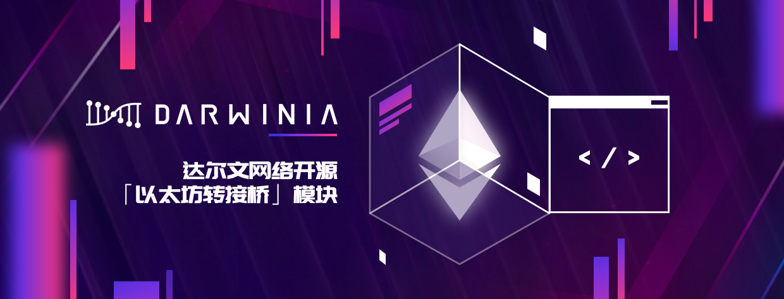
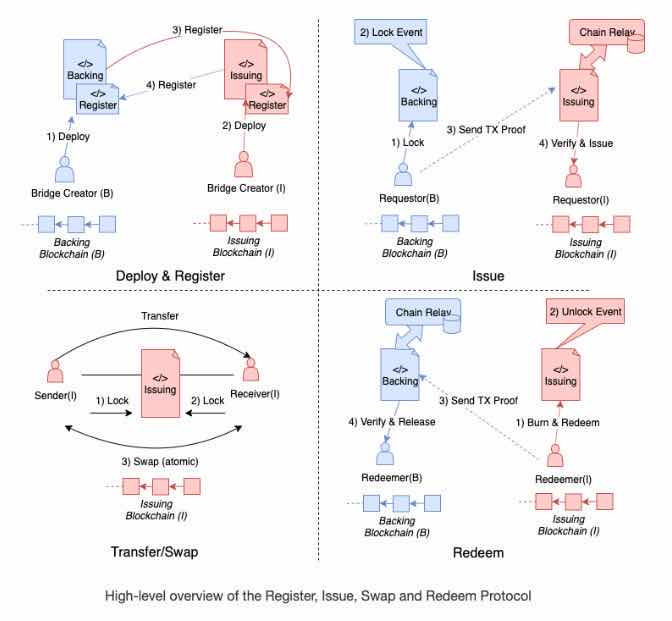

Dawinia正在研发去中心化资产背书技术，包括高性能跨链中继服务Darwinia Relay，异构链跨链转接桥，非标资产跨链标准，跨链兑换协议等等。

<!--truncate-->

最近，Darwinia开源了其基础版以太坊跨链转接桥Eth-relay模块的实现，Eth-relay是Darwinia去中心化资产背书技术的核心模块之一，Eth-relay模块源代码地址：

https://github.com/darwinia-network/darwinia/tree/develop/srml/eth-relay

常见的跨链转接桥方案可以分为同构链和异构链两类，对于同构链来说，由于享有共享安全池、相同账户体系、密码学原语以及共识算法，不同链之间的连接相对来说比较容易，例如波卡就可以通过共享安全池、XCMP和SPREE等模块实现平行链之间的跨链。

跨链真正的挑战是异构链之间的连接，目前异构链方案中，一般分为多签信托节点和基于Light Client的转接桥方案，其中相对安全和稳定的方案是基于对手链轻节点的桥接链解决方案。

回顾一下跨链转接桥的历史，之前开源的有Consensys研发的BTC Relay，这是一个BTC至ETH的单向桥，通过使用以太坊智能合约实现BTC的Light Client来验证BTC上的交易。此外，还有Kyber Network开发的WaterLoo EOS-ETH双向转接桥，分别在ETH和EOS上实现对手链的轻节点，但是因为智能合约的运行成本比较高，WaterLoo对于Ethash的验证逻辑还是做了一些妥协，没有做到完全去中心化。此次，Darwinia开源的 eth-relay模块是使用Subtrate开发和实现的，相对于智能合约，Substrate运行时模块提供更多的灵活性，特别是在燃料费和运行成本方便可以做很多优化，在保证完全去中心化的基础上还可以提供更好的经济可行性。

Eth-relay模块是一个ETH-Darwinia单向桥，通过在Darwinia中开发一个以太坊的Light Client实现。最近，Darwinia还将发布一项最新的转接桥研究成果Darwinia Relay，Darwinia Relay是一个通用的跨链转接桥方案，主要是为了解决了成本和性能问题，因为传统的跨链转接桥需要中继对手链上的每一个区块头至链上轻客户端，如果对手链的出块速度很快，那么区块头的上链成本就会非常高昂，使得方案变得经济不可行，而无法大规模应用。Darwinia Relay通过在链上实现一个Super Light Client，在降低成本的同时实现跨链验证的目的。Super Light Client使用了特殊的MMR数据结构，目前已经被Grin、Beam等项目采用，但是在对手链不支持Super Light Client的情况下，链上实现Super Light Client还有很多链下实现没有遇到的挑战，Darwinia Relay创新性的解决了链上实现Super Light Cient的挑战，并整合成一套经济可行的跨链转接桥方案，为未来异构链的跨链提供一个方向。

**重新定义达尔文（DARWINIA）**

达尔文网络（DARWINIA）基于Substrate开发的跨链应用枢纽和资产互联网络。

达尔文网络是开放的应用跨链协议，主要专注于建设未来资产互联网络，包括游戏资产和非标资产的跨链，稳定币的跨链，应用链跨链等业务。

目前，达尔文网络已经多个应用领域达成合作，包括与EvolutionLand合作的游戏资产跨链业务支持，同时与MakerDAO合作，将搭建稳定币DAI跨链转接桥，并基于Substrate开发支付应用链，DAI将可以通过Darwinia网络跨链至波卡平行链和Darwinia网络。

为了推进这些业务，Dawinia正在研发去中心化资产背书技术，包括高性能跨链中继服务Darwinia Relay，异构链跨链转接桥，非标资产跨链标准，跨链兑换协议等等。

通过达尔文网络，用户将可以使用达尔文网络来实现资产的跨链转账和流通，开发者可以通过使用达尔文网络便捷的跨链基础服务，实现应用链资产的跨链互联。